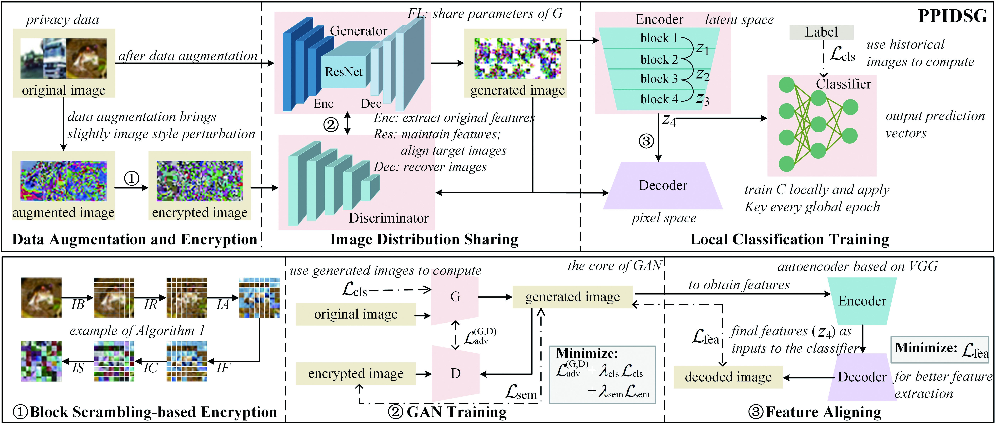

# PPIDSG: A Privacy-Preserving Image Distribution Sharing Scheme with GAN in Federated Learning

## Abstract
Federated learning (FL) has attracted growing attention since it allows for privacy-preserving collaborative training on decentralized clients without explicitly uploading sensitive data to the central server.
However, recent works have revealed that it still has the risk of exposing private data to adversaries.
In this paper, we conduct reconstruction attacks and enhance inference attacks on various datasets to better understand that sharing trained classification model parameters to a central server is the main problem of privacy leakage in FL.
To tackle this problem, a privacy-preserving image distribution sharing scheme with GAN (PPIDSG) is proposed, which consists of a block scrambling-based encryption algorithm, an image distribution sharing method, and local classification training.
Specifically, our method can capture the distribution of a target image domain which is transformed by the block encryption algorithm, and upload generator parameters to avoid classifier sharing with negligible influence on model performance.
Furthermore, we apply a feature extractor to motivate model utility and train it separately from the classifier.
The extensive experimental results and security analyses demonstrate the superiority of our proposed scheme compared to other state-of-the-art defense methods.

This framework of PPIDSG is shown in below.



## Code

Our defense code is developed based on [CycleGAN](https://github.com/junyanz/CycleGAN) and [Federated Learning](https://github.com/AshwinRJ/Federated-Learning-PyTorch).

The ''Prediction vectors'' method in experiments is [ML-leaks](https://github.com/shrebox/Privacy-Attacks-in-Machine-Learning).


## Setup
```
numpy=1.19.5
python=3.6.5
pytorch=1.7.1+cu110
torchvision=0.5.0
tqdm=4.63.0
```

## Attack 
### Step1 Download datasets
| Name            | Link                                                         | num_channel | Size  |
|-----------------|--------------------------------------------------------------|-------------|-------|
| `MNIST`         | [Download](http://yann.lecun.com/exdb/mnist/)                | 1           | 28*28 |
| `Fashion-MNIST` | [Download](https://github.com/zalandoresearch/fashion-mnist) | 1           | 28*28 |
| `CIFAR10`       | [Download](https://www.cs.toronto.edu/~kriz/cifar.html)      | 3           | 32*32 |
| `SVHN`          | [Download](http://ufldl.stanford.edu/housenumbers/)          | 3           | 32*32 |

### Step2 Prepare defense baselines
| Baselines | Original paper                                                                                                                                            | Link                                                                                 |
|-----------|-----------------------------------------------------------------------------------------------------------------------------------------------------------|--------------------------------------------------------------------------------------|
| `ATS`     | [Privacy-preserving Collaborative Learning with Automatic Transformation Search.](https://arxiv.org/abs/2011.12505)                                       | [code](https://github.com/gaow0007/ATSPrivacy)                                       |
| `EtC`     | [Encryption-then-Compression Systems using Grayscale-based Image Encryption for JPEG Images.](https://arxiv.org/abs/1811.00236)                           | [code](https://github.com/MADONOKOUKI/Block-wise-Scrambled-Image-Recognition)        |
| `DP`      | [Federated Learning With Differential Privacy: Algorithms and Performance Analysis.](https://ieeexplore.ieee.org/document/9069945)                        | [code](https://github.com/wenzhu23333/Differential-Privacy-Based-Federated-Learning) |
| `GC`      | [Deep Leakage from Gradients.](https://arxiv.org/abs/1906.08935)                                                                                          | [code](https://github.com/mit-han-lab/dlg)                                           |
| `FedCG`   | [FedCG: Leverage Conditional GAN for Protecting Privacy and Maintaining Competitive Performance in Federated Learning.](https://arxiv.org/abs/2111.08211) | [code](https://github.com/FederatedAI/research/tree/main/publications/FedCG)         |

We modify these methods for adapting federated learning.
More detail are shown in ```src/```.

Ours code is shown in ```PPIDSG/```.
### Step3 Hyperparameter setting
You should set hyperparameters before you launch attack.
- **Label inference attack** 
-     activation function: need to set in each model (Sigmoid, ReLU, LeakyReLU)
    1. **ATS**
    - **dataset:** MNIST, FMNIST, CIFAR10, SVHN
    - **ATS_Policy:** MNISTPolicy / CIFARPolicy / SVHNPolicy; **transfroms.Normalize**
    - **model:** ConvNet / ResNet18 / LeNet
      - **input_channel:** 1 (MNIST / FMNIST) / 3 (CIFAR10 / SVHN)
      - **LeNet:** LeNetZhu (CIFAR10 / SVHN) / LeNetZhu_mnist (MNIST / FMNIST)
      - **function:** Sigmoid / ReLU / LeakyReLU
    - **imidx_list:** the data index
    2. **EtC**
    - **dataset:** MNIST, FMNIST, CIFAR10, SVHN
    - **EtC_Policy:** EtC_cifar (CIFAR10 / SVHN) / EtC_mnist (MNIST / FMNIST)
      - transfroms.Resize: 28 / 32; **transforms.Normalize**
    - **model:** ConvNet / ResNet18 / LeNet
      - **input_channel:** 1 (MNIST / FMNIST) / 3 (CIFAR10 / SVHN)
      - **LeNet:** LeNetZhu (CIFAR10 / SVHN) / LeNetZhu_mnist (MNIST / FMNIST)
      - **function:** Sigmoid / ReLU / LeakyReLU
    - **imidx_list:** the data index
    3. **DP**
    - **DP_Policy:** dp_clip / dp_epsilon / datasize
      - **dp_clip / dp_epsilon:** 5, 10, 20
      - **datasize:** 32, 64, 128
    - **model:** LeNetZhu (CIFAR10 / SVHN) / LeNetZhu_mnist (MNIST / FMNIST)
      - **function:** Sigmoid / ReLU / LeakyReLU
    - **imidx_list:** the data index
    4. **GC**
    - **GC_Policy:** percentage / datasize
      - **percentage:** 10, 20, 40
      - **datasize:** 32, 64, 128
    - **model:** LeNetZhu (CIFAR10 / SVHN) / LeNetZhu_mnist (MNIST / FMNIST)
      - **function:** Sigmoid / ReLU / LeakyReLU
    - **imidx_list:** the data index
    5. **FedCG**
    - **dataset:** MNIST, FMNIST, CIFAR10, SVHN
    - **FedCG_Policy:** datasize
      - **datasize:** 32, 64, 128
    - **imidx_list:** the data index
    - **num_channel:** 1 (MNIST / FMNIST) / 3 (CIFAR10 / SVHN)
      - set in the ```src/FedCG/config.py```


- **Membership inference attack** 
-     Note: train models first, then attack (ReLU function)
      dataset: MNIST, FMNIST, CIFAR10, SVHN (in src/'baselines_name'/options.py)
      part: two clients; all: all clients (ten clients)

    1. **ATS**
    - **ATS_Policy:** MNISTPolicy / CIFARPolicy / SVHNPolicy
    - **model:** ResNet18
      - **input_channel:** 1 (MNIST / FMNIST) / 3 (CIFAR10 / SVHN)
    2. **EtC**
    - **EtC_Policy:** EtC_cifar (CIFAR10 / SVHN) / EtC_mnist (MNIST / FMNIST)
    - **model:** ResNet18
      - **input_channel:** 1 (MNIST / FMNIST) / 3 (CIFAR10 / SVHN)
    3. **DP**
    - **DP_Policy:** dp_clip / dp_epsilon / datasize
      - **dp_clip / dp_epsilon:** 5, 10, 20
    - **model:** LeNetZhu (CIFAR10 / SVHN) / LeNetZhu_mnist (MNIST / FMNIST)
    4. **GC**
    - **GC_Policy:** percentage
      - **percentage:** 10, 20, 40
    - **model:** LeNetZhu (CIFAR10 / SVHN) / LeNetZhu_mnist (MNIST / FMNIST)
    5. **FedCG**
    - need to change the dataset: MNIST, FMNIST, CIFAR10, SVHN
    6. **ours**
   - **model:** Generator, Discriminator, Feature Extractor, Classifier
     - **input_channel:** 1 (MNIST / FMNIST) / 3 (CIFAR10 / SVHN)


- **Reconstruction attack** 
-     dataset: MNIST(28*28), FMNIST(28*28), CIFAR10(32*32), SVHN(32*32)
      LeNet: channel=1 (MNIST / FMNIST); channel=3 (CIFAR10 / SVHN); Sigmoid function
    1. **ATS**
    - **ATS_Policy:** MNISTPolicy / CIFARPolicy / SVHNPolicy
    2. **EtC**
    - **EtC_Policy:** EtC_cifar (CIFAR10 / SVHN) / EtC_mnist (MNIST / FMNIST)
    3. **DP**
    - **DP_Policy:** dp_clip / dp_epsilon / datasize
      - **dp_clip / dp_epsilon:** 5, 10, 20
    4. **GC**
    - **GC_Policy:** percentage
      - **percentage:** 10, 20, 40
    5. **FedCG**
    - Resize image to 32 * 32
    - change the image_channel in ```src/FedCG/config.py``` (1: MNIST / FMNIST; 3: SVHN / CIFAR10)
    6. **ours**
   - **model:** Generator, Discriminator, Feature Extractor, Classifier
     - **input_channel:** 1 (MNIST / FMNIST) / 3 (CIFAR10 / SVHN)
   - need the trained model parameters to attack
   - **mode:** dummy_data / test_data
     - **dummy_data:** random input
     - **test_data:** an image from test dataset

### Step4 Launch attacks
- **label inference attack:** you can carry out this attack in ```LIA/```.
- **Membership inference attack:** you can carry out this attack in ```MIA/```.
- **Reconstruction attack:** you can carry out this attack in ```RS/```.


## PPIDSG 
### Step1 Download datasets.
You should download datasets before you train our scheme.

### Step2 Train and test.
Set hyperparameters of num_channel, dataset, input_size, crop_size, resize_scale, num_epochs, batch_size

After setting our hyperparameters in ```PPIDSG/options.py```, you can train PPIDSG by
```
python main.py 
```

## Notes

(1) You need change the activation function (Sigmoid, ReLU, LeakyReLU) in each classification model.

(2) For EtC policy, we set the image size to 32 * 32 in MNIST and Fashion-MNIST datasets when we need the block size to be 8, and 16.
    
    -You should change the number in IS when you change the block size.
    -You should change the number of ''negaposi'' function in src/EtC/EtC_cifar.py and src/EtC/EtC_mnist.py when you change the block size. 

(3) The hyperparameters of each baseline are configured in the ```/src/''baseline_name''/options.py```.

(4) You can change the block encryption algorithm in ```src/EtC/EtC_cifar.py``` and ```src/EtC/EtC_mnist.py```.

(5) Add more data augmentation function in ```PPIDSG/utils.py```.

(6) The value of control factor(lambda) can be changed in ```PPIDSG/update.py```.

(7) The ''in_feature'' in last fully connected layer of all models is 588 (image_size: 28 * 28) or 768 (image_size: 32 * 32).

(8) Note the setting of the image save directory position.

(9) The input channel is 1 in MNIST and Fashion-MNIST (FMNIST) datasets, while the channel is 3 in CIFAR10 and SVHN datasets.
 
